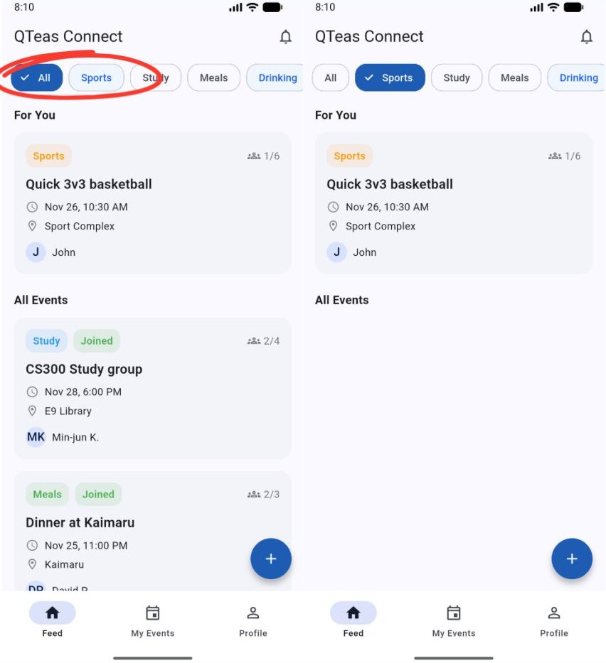
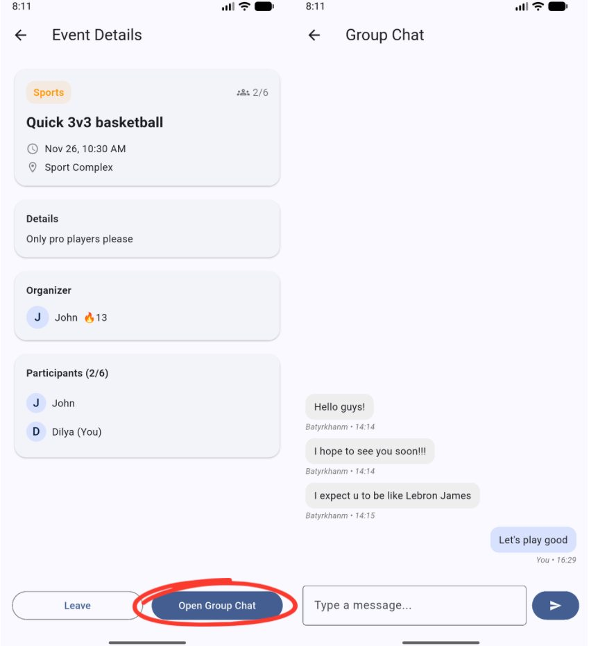
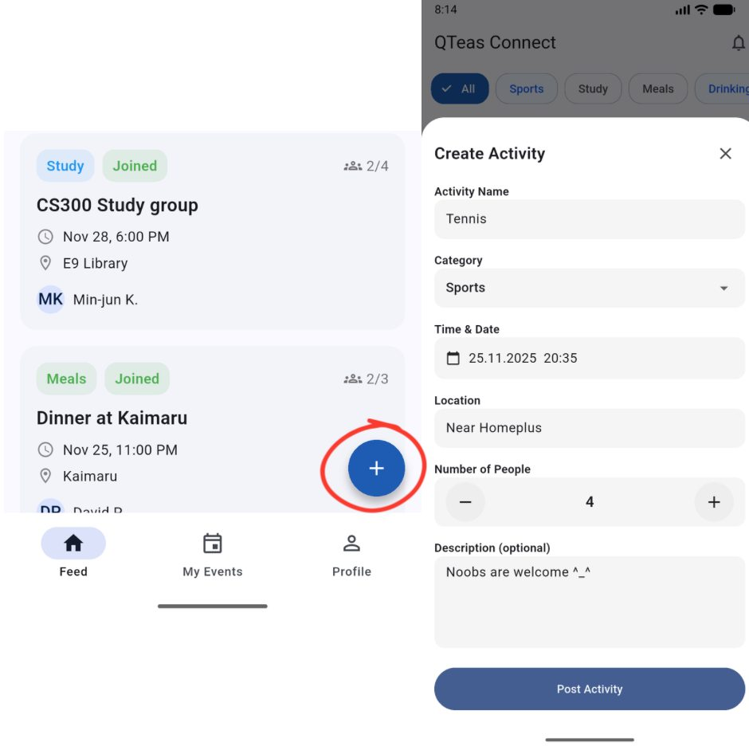
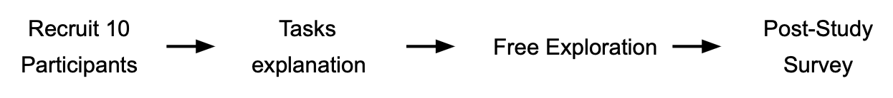
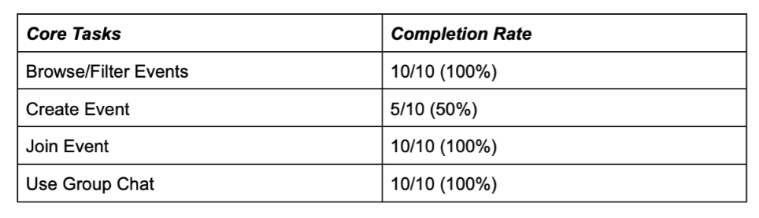
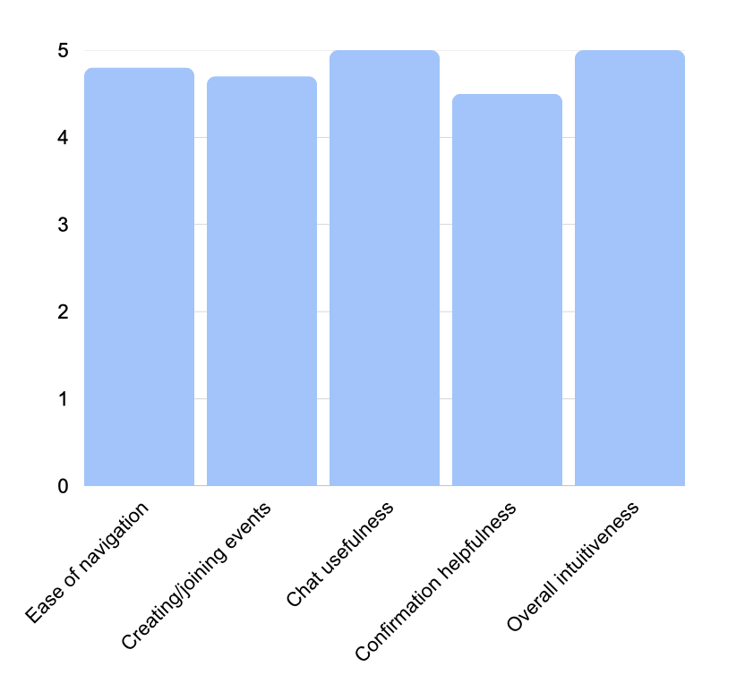

# DPM5: Final Report

## Team QTeas

### **Representative Screenshots:**

 

Figure 1. Browsing and Filtering Events based on Category on the Main Feed Page.

 

Figure 2. Automatic Grouping into Chat after Joining an Event

 

Figure 3. Creating an Event Post Functionality on the Main Feed

 

Figure 4. A Mandatory Confirmation Check in Notifications Page.

### **Quality Arguments:**

Our system addresses the challenge of social interactions on campus by providing a secure, transparent platform for finding shared activities. The interface facilitates these spontaneous connections through a design framework that prioritizes low-friction entry, seamless coordination, and high accountability.

#### *Streamlined Discovery & Usability*

To reduce the friction of starting a social interaction, we optimized the Browsing and Filtering system (Figure 1) for immediate ease of use. By adopting familiar mobile patterns—such as sticky headers and category tags—the interface feels intuitive from the first use. Similarly, the Create Event flow (Figure 3) uses structured inputs to ensure essential details (time, location) are captured without overburdening the host. Users confirmed this balance effectively 'lowered the barrier' to organizing meetup events.

#### *Novelty in Social Interaction*

A major friction point in existing campus tools is the "fragmentation" between finding an event and coordinating it. We addressed this with a novel UI contribution: Automatic Grouping (Figure 2). Unlike standard bulletin boards, our system instantly transitions users from the "Join" button into a dedicated, context-specific chat. This centralizes logistics and removes the need to swap contact information. As one participant noted: "I liked the fact that there was no need to ask for and collect IDs to create a chat; all users were automatically sent to a general chat where all the old history was visible."

#### *Robustness & Accountability*

To reduce the rate of last-minute cancellations ("no-shows"), we designed a Mandatory Confirmation Check (Figure 4). This prompt requires users to make a clear choice - either confirming their attendance or leaving the event - before proceeding. By forcing an active decision, the system filters out uncommitted users. This successfully reinforced social accountability, with one user noting: “This helps me remember the event I registered for and so plan my activities properly.”

### **Deployment Summary:**

#### *Study Design & Recruitment*

We recruited 10 KAIST students (5 Koreans,5 internationals) from diverse majors and academic years (1st-4th year) through campus channels including KakaoTalk groups and word-of-mouth. Participants were guided through a 2-day testing period where they freely explored the app while completing structured tasks such as browsing/filtering events, creating events, joining with automatic group chat, and confirming attendance. Feedback was collected through a post-study survey and follow-up interviews in order to get both quantitative and qualitative feedback. The goal of this deployment was to evaluate whether the system supported our core functionalities as intended.

 

Figure 5. Study Procedure

#### *Results:*

All core user flows were successfully completed by nearly all participants, indicating that the system functioned as intended. Survey responses provided both quantitative ratings and comments that further describe users’ experiences.

 

Figure 6. Usage Outcomes

#### *Platform Activity During Study:*

-   *5 events created*
-   *14 event joins across users*
-   *All (5/5) events had active group chats*

#### *User Satisfaction Ratings:*

Participants rated features on a 5-point scale. Scores below represent averages across all 10 participants:

 

Figure 7. Quantitative Feedback

Survey feedback was strongly positive: ease of navigation averaged 4.8, creating and joining events 4.7, chat usefulness 5, confirmation helpfulness 4.6, and overall intuitiveness 5.

#### *Qualitative Insights*

From open-ended feedback, users appreciated fast event creation and one-tap joining, noting these lowered the barrier to spontaneous participation. The automatic group chat centralized coordination and reduced tool-switching, while mandatory attendance confirmation increased accountability. They also highlighted improvements such as clearer “joined” badges, a clearer scroll indicator for categories, reduced feed-loading delays, and optional social features like adding friends.

#### *Summary*

Overall, the deployment showed that the system reliably supported discovering, organizing, and coordinating spontaneous activities. Users completed all core tasks, and feedback focused on refinements rather than redesign, indicating strong alignment with the system’s design goals.

### **Discussion:**

#### *Participation Incentives*

The design of QTeas draws on several major ideas in social computing, one of which was ensuring that students would actually contribute events rather than passively consuming the feed. Based on principles of incentives and value from the course, our app reduces the “activation energy” needed to participate since event creation uses a short structured form, categories highlight what users are already interested in, and joining an activity instantly places the user into a dedicated group chat. These low-friction entry points act as participation incentives by making spontaneous social interaction feel attainable even during busy weeks.

#### *Norm Formation*

QTeas app shapes descriptive norms by showing how many people have joined an event. Even without explicit messaging, users see that small, casual gatherings are normal on campus. This helps reduce social anxiety around hosting, and once a few organizers post events, others are more likely to follow. Injunctive norms also emerge subtly as users see that events include clear times, locations, and categories, so writing concise and purposeful event descriptions becomes the expected behavior. Even without an upvoting system or public comments, the structure itself guides users toward constructive participation.

#### *Social Translucence*

Our app also incorporates features related to social translucence, especially visibility and accountability. Participants can see who else is attending and who has confirmed, which creates mutual awareness and strengthens accountability. This is particularly relevant for small events like study groups or sports meetups, where visibility of attendance helps set expectations and reduces uncertainty. The automatic group chat enhances awareness further, because only event participants can chat, conversations remain contextual and relevant, avoiding the chaos of large, unstructured channels.

#### *Collaboration Support*

Collaboration concepts also shaped the design. QTeas supports ad-hoc coordination by placing communication and logistics in one place. Instead of users switching between other messengers such as WhatsApp or KakaoTalk, the event page and chat consolidate everything. This removes a common barrier in group activities “coordination overhead” and aims to show that clearer shared communication reduces coordination breakdowns.

#### *Reducing Social Loafing*

The platform also uses lightweight mechanisms to reduce social loafing. Users who join an event but do not confirm create ambiguity for the organizer. By requiring mandatory checks to “Confirm” or “Leave Event” via notifications from the users, the app encourages individuals to take responsibility for their participation. This increases perceived commitment without enforcing strict rules, leveraging visibility to discourage passive or unreliable behavior.

#### *Quality Control*

Finally, the app’s structure implicitly performs quality control. Because events require categories, times, and locations, low-quality or vague posts are naturally filtered out. Hosts retain control over editing participants list or canceling events, and the absence of open commenting prevents harassment or derailment. Rather than heavy moderation, QTeas relies on structured interaction and lightweight visibility cues to maintain a healthy ecosystem.