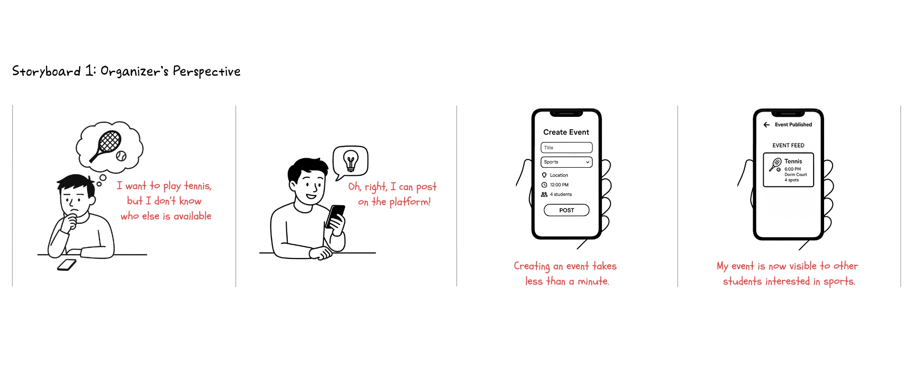
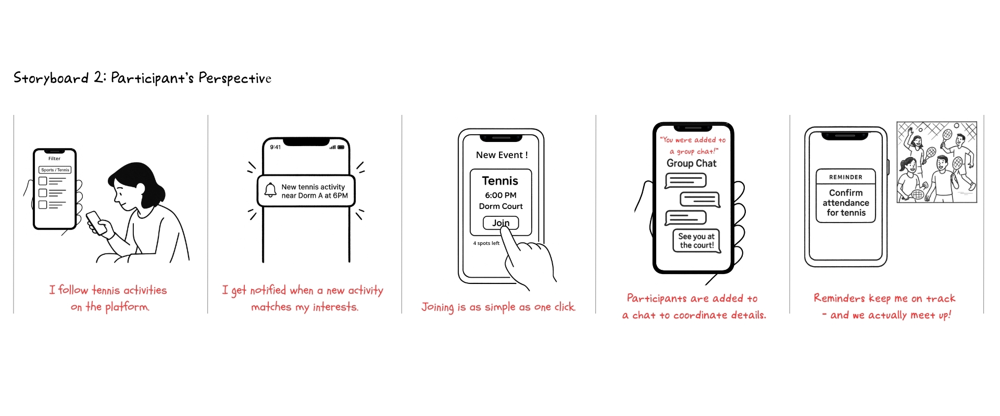
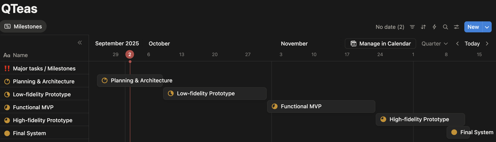
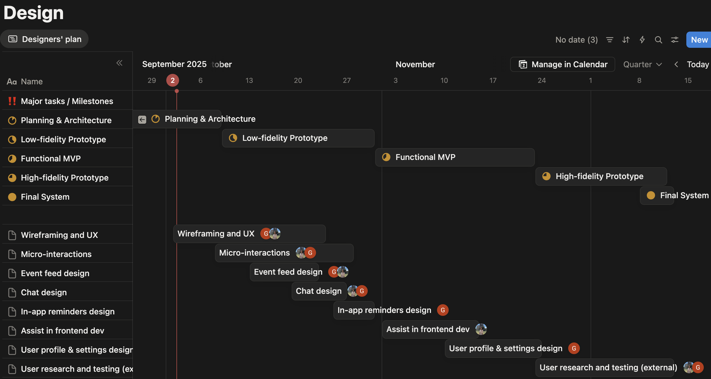
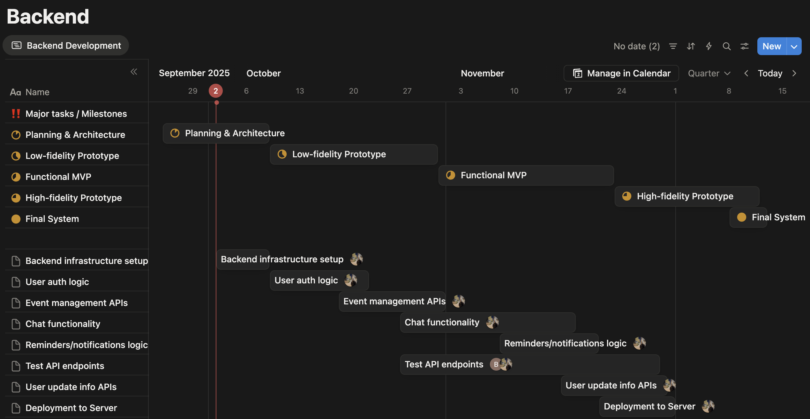
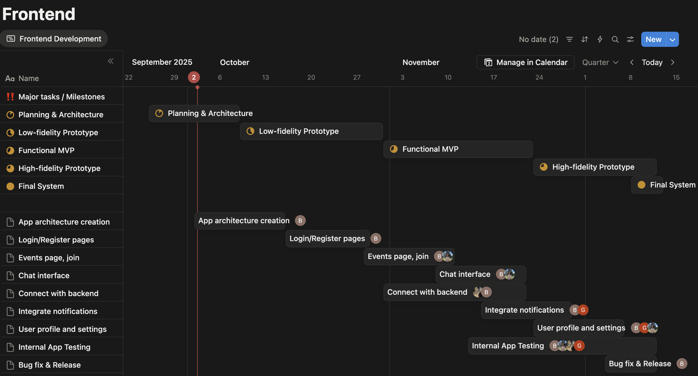

DPM2: Pitch Report

Team QTeas

**Problem statement:**

> Students at tech-focused universities like KAIST with reserved socialculture and demanding academic workloads struggle to find peers withaligned free time for shared activities, leading to missedopportunities for social connections and weaker community bonds.

**Solution:**

> Our solution is a mobile application designed for students who want toeasily discover, organize and join activities anytime. The platformprovides a real-time activity feed where students can **browse andfilter events** by categories such as sport activities, studysessions, meal sharing, and etc. Any student can **post** an activityin under a minute, while others can **join with** a single click.Organizers can display essential information like time, location,participant count, and profile information.
> 
> Once a student joins an activity, they're automatically added to adedicated **group chat** where all joined participants can introducethemselves and discuss before meeting. Participants also receiveescalating **reminders** which start as an in-app notice 24 hours, apush-notification to the device 3 hours, and a push-notification witha mandatory confirmation request 30 minutes before the event, ensuringhigh follow-through rates by reducing forgetfulness.
> 
> This solution is feasible because it relies on lightweight event poststhat automatically expire to reduce system complexity, straightforwarddatabase structures to track activities and users, and stable patternslike reminders, notifications, and one-click joining. Its designensures students can post or join activities, making it realistic todevelop and highly suited to universities' fast-paced, spontaneouscampus culture. It fosters inclusivity for newcomers, and creates areal-time social ecosystem on campus while maximizing social impactthrough simple UX design.
> 
> Storyboards:
> 
> -   Organizer’s Perspective 
> 
> 
> 
> -   Participant’s Perspective
> 
>  

**Core Tasks:**

> The following are the core tasks that our solution system willsupport. Each is central to solving the project problem by making iteasier for students to gather together for events, and eachexplanation highlights how the task is achieved with our solution.
> 
> **Task 1.** Creating an Event Post
> 
> A student wants to organize a quick basketball game or study session.They open the app, tap "Create Event", and simply enter the activityname, category, time, location, and number of desired participants.The post instantly appears in the live feed and will automaticallyexpire after the event time. This task is core because it encouragesany student to initiate activities quickly, lowering the barrier toorganizing events and directly addressing the difficulty of findingpeers with aligned free time.
> 
> **Task 2.** Browsing and Filtering Events
> 
> A student opens the platform and browses a real-time feed ofactivities happening soon nearby. They can filter events by category(such as sports, study, drinking), and browse events available at achosen date and time. This task is core because it allows students toidentify people and events they would otherwise miss, directlyaddressing the problem of not being able to meet with people who arefree for the same time slots.
> 
> **Task 3.** Automatic Grouping of Participants
> 
> After choosing an interesting event, the student taps the "Join Now"button, and the system automatically groups them with otherparticipants and launches an event chat for further discussions. Thisavoids fragmentation across multiple apps and keeps event discussions,logistics, and updates in one place. This task is core because itcentralizes event organization, reducing miscommunication and makingparticipation more seamless.
> 
> **Task 4.** Sending Reminders and Confirming Attendance
> 
> As the event approaches, the system sends escalating reminders 24hours (in-app notice), 3 hours (push-notification), and 30 minutesbefore (push-notification with a request to tap the "ConfirmAttendance" button) the start of an event. This task is core becauseit addresses user forgetfulness and increases reliability ofattendance for a better turnout.

**Competitive Analysis:**

> We benchmarked three existing platforms frequently used by students inKorea or globally for social and activity coordination:
> 
> 1.  **Dangeun (Karrot / 당근마켓)** - A hyperlocal community marketplaceapp primarily used for second-hand trading, but also offeringneighborhood groups, events, and activity boards where people canconnect with others nearby. [1]
>     
> 2.  **KakaoTalk groupchats & Open Chat** - A messaging platform whereusers can create private or public group chats to organize events,coordinate activities, or meet new people through interest-based openchat rooms. [2]
>     
> 3.  **Meetup** - A global platform for organizing and joininginterest-based groups and events, enabling people to connect throughshared hobbies, professional interests, or social activities bothonline and offline. [3]
>     
> 
> For each alternative, we compared core features/characteristicsrelevant to our problem statement:
> 
> 1.  Ease of Activity Creation.
> 
> Ease of activity creation measures the interactional and cognitivecost required for a user to post an event - a primary determinant ofcontribution behavior in social systems. High friction (many fields,unclear affordances, or long forms) suppresses spontaneous postingsand biases the platform toward only highly motivated organizers;therefore we compared step count, required fields, and averagetime-to-post to predict raw event generation and diversity oforganizers among busy students.
> 
> 2.  Discovery and Visibility of Activities.
> 
> Discovery and visibility capture how effectively opportunities areexposed to potential participants without requiring prior socialties - a critical factor for reducing network-entry barriers andenabling peripheral users to become active. Platforms that bury eventsinside private groups create participation inequality and limitserendipitous encounters; compare feed prominence, search/filterfeatures, geotemporal ranking, and whether weak-tie discovery (openfeed vs closed chat) is supported to assess how likely newcomers willfind and join events.
> 
> 3.  Coordination Tools.
> 
> Coordination tools measure the presence of mechanisms that convertexpressed interest into committed attendance (e.g., RSVP, auto-groupchat, polls, reminders), and are essential because the core problem isnot only discovery but reliable coordination under time pressure. Froma social-computing perspective these affordances act as commitmentdevices and social accountability cues that mitigate collective-actionfailures and no-shows; compare whether platforms provide automaticgroup formation, staged reminders, mandatory confirmations, andorganizer signals to evaluate real-world follow-through.
> 
> 4.  Contextual Fit for Students.
> 
> Contextual fit evaluates how well a platform's identity, governance,and UX align with stundent's norms (high workload, reserved socialculture, campus-bounded communities), and it's crucial becausemisalignment (context collapse, noisy publicness) kills adoption even if feature sets are strong. Operationalize this metric by checking forcampus-specific verification (email/OTP), bounded community controls,language/localization, and post-lifespan policies (auto-expiry) -these factors predict perceived trust, safety, and the platform'sability to lower social friction for newcomers.
> 
> Comparisons:
> 
> Synthesis / justification:
> 
> -   Dangeun is local and quick but neighborhood-scoped; it lacks staged commitment mechanisms, and isn't campus-specific.
>     
> -   KakaoTalk is ubiquitous with strong messaging affordances (polls, calendar), but its discovery depends on pre-existing social tiesand it does not centralize spontaneous events for newcomers.
>     
> -   Meetup offers robust RSVP and reminder systems but is designed for planned, recurring meetups and imposes higher authoring cost.
>     
> -   QTeas Connect combines: very low posting friction + campus-bounded discovery + auto-generated group chats + escalating reminders +mandatory confirmation + auto-expiring posts. Together, theseaddress the three failure points shown in the table: (1) low contribution from busy students, (2) low visibility to newcomers(network entry barriers), and (3) unreliablefollow-through/no-shows. That data-driven gap analysis (tableabove) supports QTeas Connect as the most aligned solution to theproblem statement.
>     

**Timeline and responsibilities:**

> ****
> 
> **Major tasks / Milestones:**
> 
> 1.  Planning & architecture: [Sep 25 - Oct 8]
>     
> 2.  Low-fidelity Prototype: [Oct 9 - Oct 30]
>     
> 3.  Functional MVP: [Oct 31 - Nov 22]
>     
> 4.  High-fidelity Prototype: [Nov 23 - Dec 11]
>     
> 5.  Final System: [Dec 8 - Dec 12]
>     
> 
>  
> 
>  
> 
>    
> 
> **Responsibilities:**
> 
> **UX Designer -- Dilnaz**
> 
> -   Lead overall interaction design and **UX** flows
>     
> -   Create wireframes and lo-fi prototypes in **Figma**
>     
> -   Develop design system and style
>     
> -   Collaborate closely with frontend developer and assist
>     
> 
> **UI / Brand Designer -- Guldana**
> 
> -   Focus on **visual design/UI/branding** (such as icons, illustrations, high-fidelity mockups)
>     
> -   Refine micro-interactions, animations
>     
> -   Conduct **user research sessions** (interviews, surveys, A/B testing)
>     
> -   Assist in preparing demo/presentation visuals for studios.
>     
> 
> **Frontend (Mobile) -- Batyrkhan**
> 
> -   Develop the mobile application using **Flutter**
>     
> -   Implement event feed, filtering, chat interface, and reminders
>     
> -   Integrate with backend APIs
>     
> -   Ensure responsive design matches Figma prototypes
>     
> 
> **Backend -- Yeskendir**
> 
> -   Develop backend using **FastAPI** with **PostgreSQL** database.
>     
> -   Design and implement APIs for authentication, activity posting, joining, waitlists, and reliability metrics.
>     
> -   Set up server infrastructure
>     
> -   Manage real-time features (WebSockets for chat and push notifications)
>     

**References:**

1.  [https://www.daangn.com/kr/?in=%EB%91%94%EC%82%B0%EB%8F%99-5793](https://www.daangn.com/kr/?in=%EB%91%94%EC%82%B0%EB%8F%99-5793 "https://www.daangn.com/kr/?in=%EB%91%94%EC%82%B0%EB%8F%99-5793")
    
2.  [https://www.kakaocorp.com/page/service/service/KakaoTalk?lang=en](https://www.kakaocorp.com/page/service/service/KakaoTalk?lang=en "https://www.kakaocorp.com/page/service/service/KakaoTalk?lang=en")
    
3.  [https://www.meetup.com/](https://www.meetup.com/ "https://www.meetup.com/")