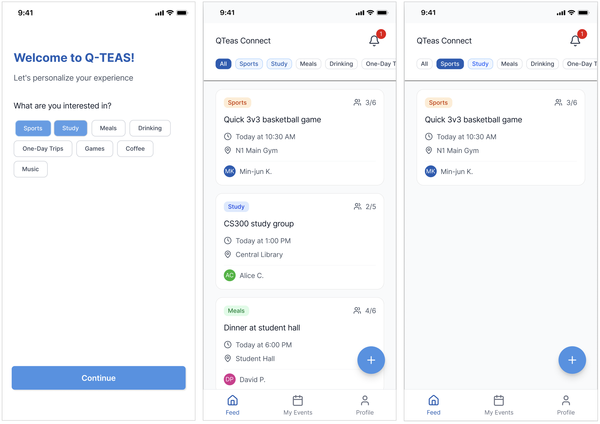
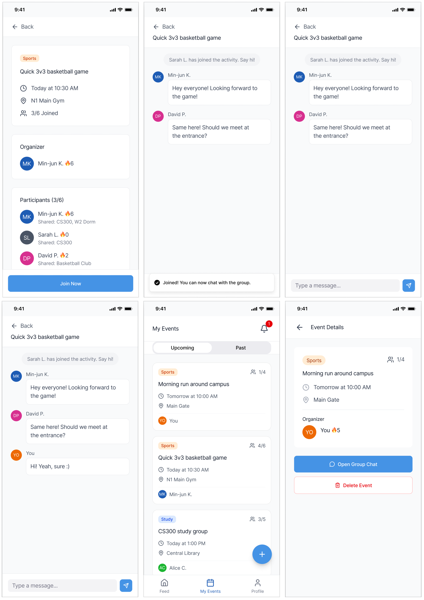
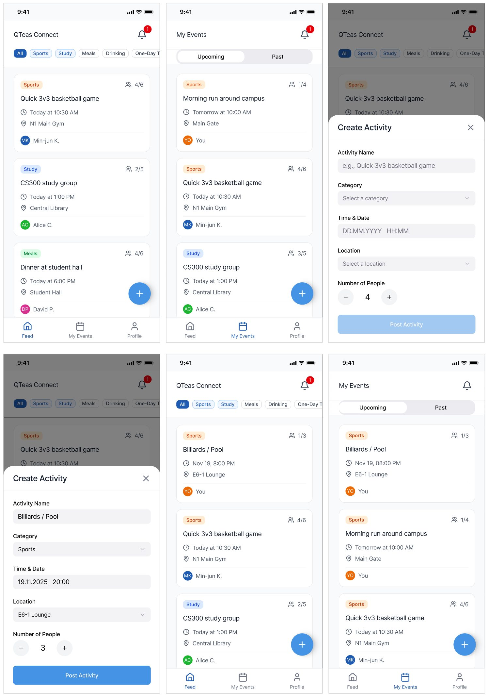
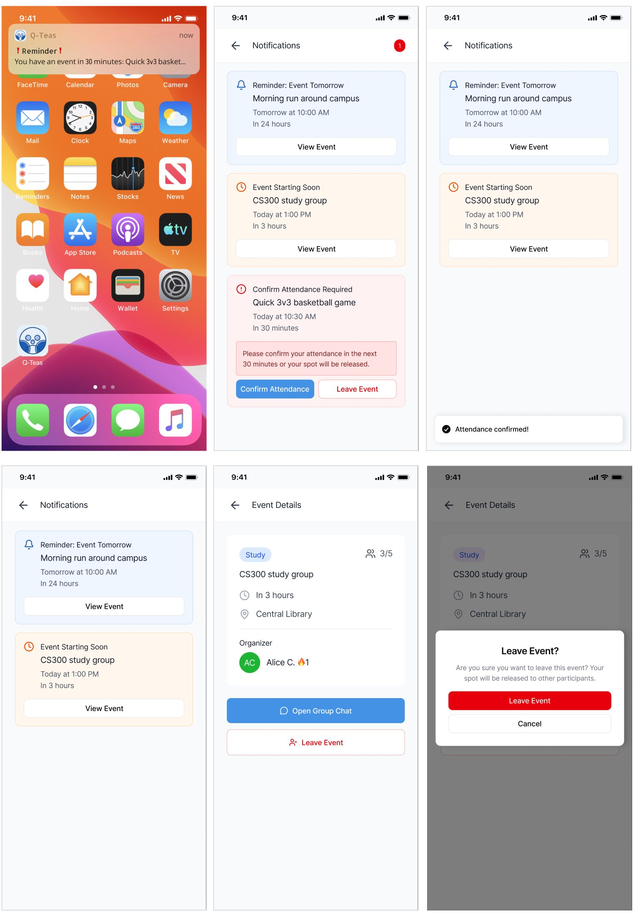
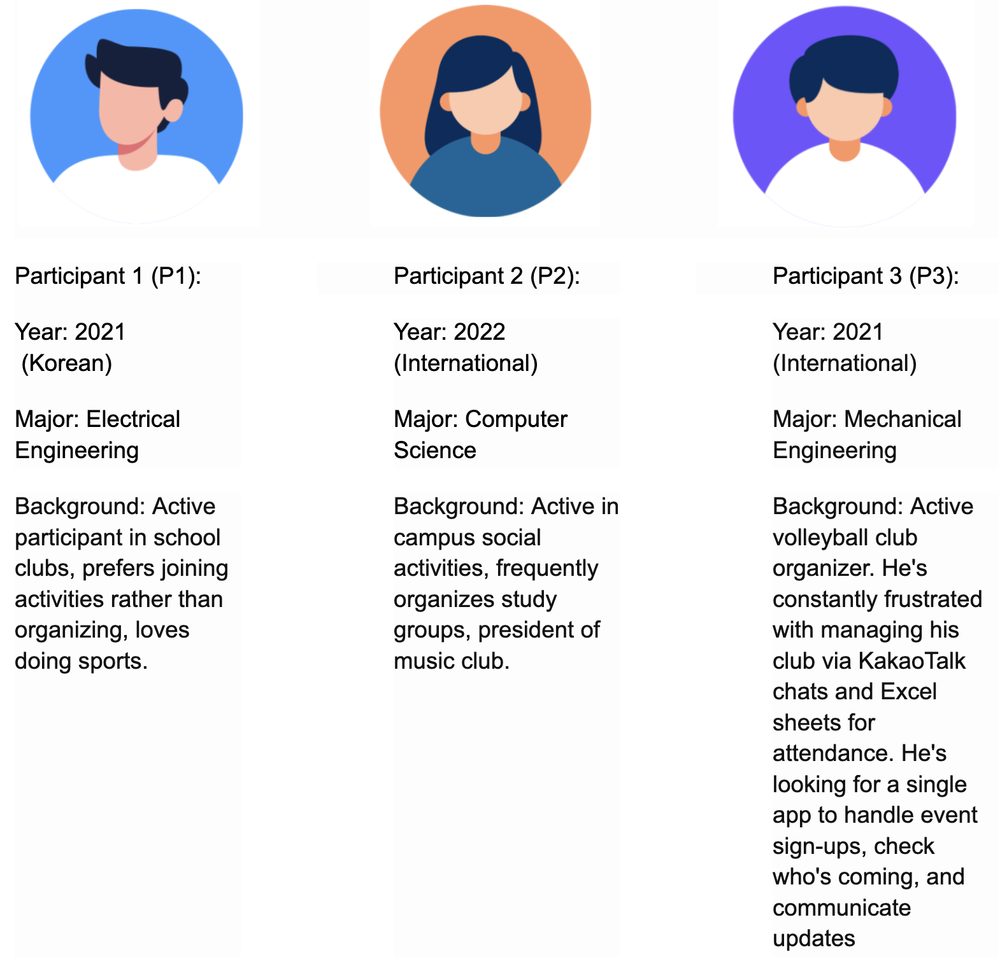
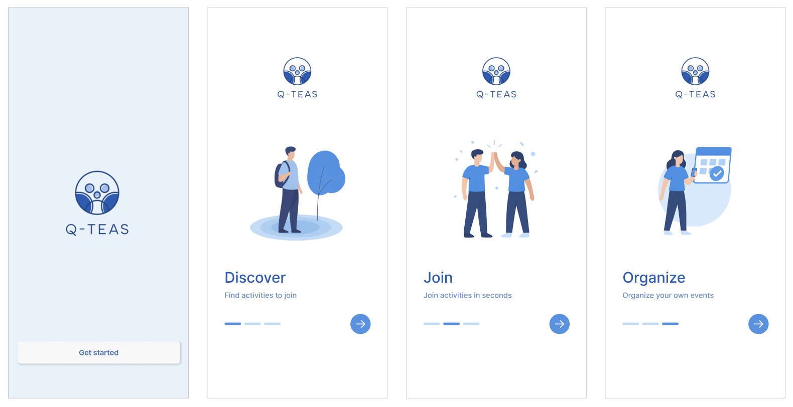
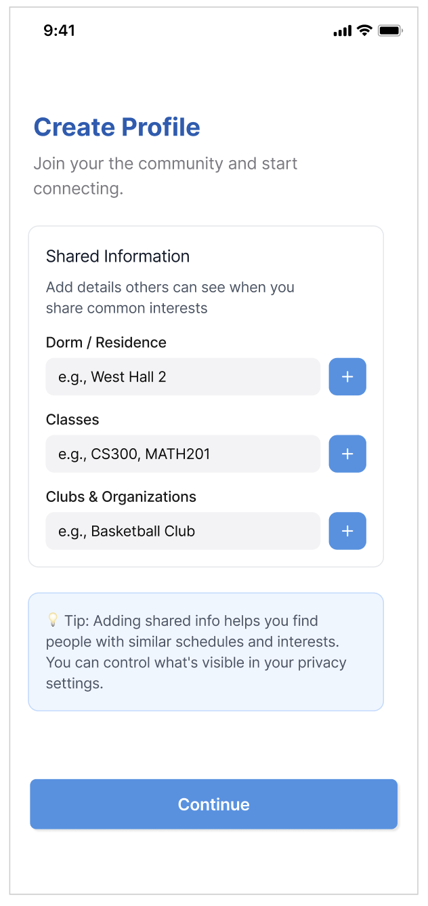

# DPM3: Low-Fidelity Prototyping Report

## **Team QTeas**

### Problem Statement

Students at tech-focused universities like KAIST, where social culture tends to be reserved and academic workloads are demanding, often struggle to find peers who share similar interests and are open to participating in interest-based activities, leading to missed opportunities for social interactions and weaker community bonds.

### Task Descriptions

Our prototype aims to support the following core tasks, each designed from the user’s perspective to address the problem of finding peers with shared interests and building stronger community connections.

#### Task 1. Browsing and Filtering events.

A user opens the platform and browses a real-time feed of activities organized by other users. They can filter events by category, such as Sports, Study, Meals, Drinking, One-day Trips, Games, Coffee, or Music, to easily find activities that match their personal interests. The user reviews event details such as time, location, and participant count before deciding to join. This task helps users discover people with similar interests and identify activities they would potentially miss, directly addressing the challenge of limited social connection.

#### Task 2. Automatic Grouping of Participants into Chat.

After selecting an interesting event, the user is automatically grouped with other participants in the dedicated event chat. Within the chat, users can introduce themselves, discuss event details, and coordinate before meeting in person. This task tackles the problem statement by enabling users to connect naturally with peers with shared interests and, also, simplifies communication by keeping all event-related conversations in one place.

#### Task 3. Creating an Event Post.

Users can easily organize an activity by filling out basic event-related information and posting it. The post appears instantly in the main feed, which allows other interested users to join. This task empowers users to take initiative and create opportunities to meet people with similar hobbies or preferences, strengthening campus community engagement.

#### Task 4. Sending a Reminder with a Mandatory Confirmation Check.

After a user joins an event, they receive a push-notification 30 minutes before the start time of the event. When they open the notification, they are required by the app to either confirm their participation in the event or leave it if they can no longer attend. This task aims to enhance community bonds among participants, by fostering a sense of responsibility among users.

## Prototype

### Summary Description of Our Tool

Our solution is a mobile application designed for students who want to easily discover, organize and join activities. The platform provides a real-time activity feed where users can browse and filter events by categories such as sports, study, meals, or coffee meetups, and join with a single tap. Any user can create an event post within seconds, while automatic group chats connect participants instantly for communication and coordination. The inclusivity and interest-driven interaction of the app lowers the social barriers that are typical of academically loaded campus cultures. The app’s series of reminders and mandatory attendance confirmation promotes a sense of responsibility, which in turn fosters a stronger sense of belonging. By simplifying discovery and participation through intuitive design, our app transforms everyday interests into real social connections and helps build an active campus community.

**Link to Our Prototype:**  
[https://www.figma.com/proto/iTgTINUkOGApVMSHPH6gul/Q-Teas?node-id=48-8243&t=77vlD5ONPnzy45K7-1](https://www.figma.com/proto/iTgTINUkOGApVMSHPH6gul/Q-Teas?node-id=48-8243&t=77vlD5ONPnzy45K7-1)

### Design Choices

We have implemented a series of stages starting from registering as a new user, selecting preferences, seeing the feed, filtering the feed, joining an event, writing in the chat, creating/deleting/leaving an event, confirming the attendance, and finishing with the changes in profile. However, there are some parts of the prototype we omitted and we will provide the reasoning behind it.

1.  **Hard-coded Input / User information.**
    
    Instead of the user being able to write anything himself, we intentionally hard-coded any data that could be entered to our application. This includes: user email, name, preferences, chat messages, other user profiles, event details while creating an event. It is done for the purpose of simplicity and because of intuitive actions behind basic typing using a keyboard.
    
2.  **Manual feed filtering algorithm.**
    
    To simplify the prototyping process, we didn’t actually implement the feed filtering algorithm. To deliver the meaning behind it, we only simulated how it works for one of the categories of an event. This allows us to visualize what the filtering result should look like and decide on it before implementing it.
    
3.  **Limited flow / interactions.**
    
    We have intentionally not implemented certain aspects of our application because they do not follow the core tasks. The login page is not fully implemented because login logic is intuitive for most of the users and is not part of our core tasks. Also, you can notice that you cannot switch between tabs from the navigation bar easily in our prototype. This is done because our pages are stateful, i.e. they change dynamically depending on the information entered/altered by the user and use no external memory. For example, if we join an event from “Feed”, it should appear in “My Events”, which adds additional complexity to our prototype. We could have added a lot of interactions to our prototype, but this would unfortunately lead to confusion and thus, we focused only on the main flow which shows an end-to-end scenario.
    
4.  **Fake events in “Feed” and “My Events”.**
    
    Due to the absence of real users and organizers at this stage, we have faked/simulated the events, event details and people visible in “Feed” and “My Events” pages. This simulation allows us to focus on how users would be interacting between each other and join/organize events. Also, this allows us to evaluate what sort of information about the user should be visible to other users before working on the high-fidelity prototype.
    
5.  **In-app reminders not included.**
    
    After careful consideration, we decided to choose only the mandatory attendance confirmation reminder 30 minutes before an event as our core task. The 24h and 3h in-app reminders are of simple design (similar to push notification that is already shown) and can be added to our app later-on, which is why they were not included in our prototype.
    
6.  **Attendance Score Counter not included**
    
    Since the attendance score is not a core part of our application, we have left the implementation for further development. For now, it shows a fake number of events attended in the profile page and near the names of other participants.
    

## Important Screenshots & Tasks Instructions

#### Task 1. Browsing and Filtering events.

**Figure 1. First, Second, and Third Screenshots**

-   While registering an account, the user selects one or more categories of event they are interested in (Figure 1. First Screenshot).
-   After category selection, the user is sent to the main page “Feed” where they see the list of activities in all categories that are being organized by other users (Figure 1. Second Screenshot).
-   The user sees the category types in the top navigation bar. For the ease of browsing, categories of interest are highlighted with pale blue color (Figure 1. Second Screenshot).
-   The user can filter events by tapping on one or more categories they are planning to participate in, which will make “Feed” show events only from the same category (Figure 1. Third Screenshot).

#### Task 2. Automatic Grouping of Participants into Chat.

**Figure 2. First, Second, Third, Fourth, Fifth, and Sixth Screenshots**

-   When the user taps an event, it directs the user to the “Event Details” page where they see the basic information about the activity (Figure 2. First Screenshot).
-   If the user decides to participate in that event, they click the “Join Now” button in the bottom of the screen (Figure 2. First Screenshot).
-   After joining the event, the user is sent to the group chat dedicated to that activity where they can send messages, such as self-introduction and discussion for an event coordination (Figure 2. Second, Third and Fourth Screenshot).
-   Later, the user can access the group chat by finding the activity in the “My Events” page (Figure 2. Fifth Screenshot) and clicking the blue “Open Group Chat” button in the middle (Figure 2. Sixth Screenshot).

#### Task 3. Creating an Event Post.

**Figure 3. First, Second, Third, Fourth, Fifth, and Sixth Screenshots**

-   In the “Feed” and “My Events” pages in the bottom navigation bar of the app, the user sees the big blue plus button on the bottom right side of their device (Figure 3. First and Second Screenshots).
-   After tapping the blue circled plus button, the user opens the bottom sheet dialog and fills out the event-related information: Activity Name, Category, Date & Time, Location, and Target Number of Participants (Figure 3. Third and Fourth Screenshot).
-   To create an event post, the user clicks the “Post Activity” button in the bottom of the screen (Figure 3. Fourth Screenshot).
-   After creating the post, it appears in the “Feed” page where everyone can see their post (Figure 3. Fifth Screenshot).
-   The post also appears in the “My Events” page since the user is automatically considered as a participant for the activity they created (Figure 3. Sixth Screenshot).

#### Task 4. Sending a Reminder with a Mandatory Confirmation Check.

**Figure 4. First, Second, Third, Fourth, Fifth, and Sixth Screenshots**

-   30 minutes before the start time of an event, the user receives the push-notification from the app (Figure 4. First Screenshot).
-   By tapping the push-notification, the user opens the “Notifications” page, where they can see the notifications of 24 hours, 3 hours, and 30 minutes before the other events (Figure 4. Second Screenshot).
-   To confirm the user’s participation, they need to tap the “Confirm Attendance” button, which will make the reminder in the “Notifications” page disappear (Figure 4. Third and Fourth Screenshots).
-   If the user can’t participate in the event, they first need to tap the “Leave Event” button, which will direct the user to the “Event Details” page (Figure 4. Fifth Screenshot).
-   In the “Event Details” page they can permanently leave the event by clicking the red “Leave Event” button (Figure 4. Sixth Screenshot).

## Observations:

**Figure 5. Participants Information**

Participants' experiences with similar apps: All three participants had prior experience with messaging and social coordination apps commonly used at KAIST. P1 regularly uses KakaoTalk for group chats and event coordination and is familiar with Everytime (에브리타임) for campus community discussions. P2 uses KakaoTalk daily, occasionally browses Dangeun (Karrot) for local community posts, and has tried Meetup once but found it too formal for casual student activities. P3 currently relies heavily on KakaoTalk group chats and Excel spreadsheets to manage his volleyball club, a process he finds frustrating and inefficient for tracking attendance and sign-ups.

### Usability Problems Discovered

#### Regarding Task 1: Browsing and Filtering events

**Problem 1:** "All" Feed Sorting is Confusing (P3) - Medium level of criticality

-   Description: When the "All" filter is selected, the feed correctly sorts events by user preferences first. However, there's no visual cue to explain this. P3 couldn't figure out the sorting order and just thought the feed was "random," completely missing the smart sorting feature.
-   Plan for improvement: Add clear section headers to the feed when "All" is selected. Show a "For You" (or "Based on Your Interests") header above the preferred events, followed by a divider and an "Other Events" header for the rest.

**Problem 2:** Category Filter Bar Isn't Obviously Scrollable (P3) - Low level of criticality

-   Description: On the main feed, P3 didn't realize the horizontal category filter (Sports, Study, Meals...) was scrollable. They only saw the first 4-5 categories and thought that was the complete list. P3 was looking for "Music" and couldn't find it.
-   Plan for improvement: Ensure the last visible category item on the right is partially cut off. This visual cue tells the user there's more content to scroll to.

**Problem 3:** Unclear "My Events" vs. Feed (P3) - Medium level of criticality

-   Description: P3 joined an event, then went to the "My Events" tab and saw it there. He then went back to the main feed and saw the same event card. This made him pause, thinking, "Did I join it or not? Why is it in both places?" He was confused if the feed was supposed to be only for events he hadn't joined.
-   Plan for improvement: Add a clear visual badge or label (e.g., a green "Joined" checkmark or "You're in!") to event cards in the main feed after a user has joined them. This confirms their action and clarifies why they're seeing it in both tabs.

#### Regarding Task 2: Automatic Grouping of Participants into Chat

**Problem 4:** Automatic Chat Join Causes Confusion (P2) - Medium level of criticality

-   Description: Users are automatically added to the event group chat upon joining, but expected to manually navigate to it. This wasn't clear from the UI.
-   Plan for improvement: After clicking "Join Now," show a brief confirmation modal: "You've joined! [View Event Chat]" with a direct button to the chat.

#### Regarding Task 3: Creating an Event Post

**Problem 5:** No Notification for Organizer When Someone Joins/Leaves (P1) - High level of criticality

-   Description: Event organizers don't receive any notification when a participant joins or leaves their event. This makes it difficult to track attendance and plan accordingly.
-   Plan for improvement: Implement push notifications and in-app badges for organizers when: (1) someone joins their event, (2) someone leaves, (3) the event reaches maximum capacity. Include a participant count update in the notification.

**Problem 6:** Organizer Cannot Manage Participants (P3) - High level of criticality

-   Description: As the event organizer (P3), he saw the participant list on the event details screen but had no way to manage it. He was concerned about what to do if someone who joined was a known "no-show" or if he needed to remove a participant for any reason. Tapping on a participant's name (like "Sarah L.") in the list did nothing, but he expected it to open options to "Remove from Event" or "View Profile."
-   Plan for improvement: Update the Event Details screen so that only the organizer can tap on a participant's name. When they do, open a small modal with options to "View Profile" and "Remove from Event." This gives organizers control over their attendee list.

#### Other (User Registration and Onboarding):

**Problem 7:** Welcome/Tutorial Screen Shown on Every Login (P2) - High level of criticality

-   Description: The welcome tutorial appears every time the user logs in, not just on first sign-up. This creates unnecessary friction for returning users.
-   Plan for improvement: To track whether the tutorial has been shown for the user. Display welcome screens only when FirstLogin is True, then set to false after completion.

**Figure 6. Problem 7**

**Problem 8:** Lack of Student Year Display (P2) - Medium level of criticality

-   Description: User profiles don't show which year the student is in (freshman, sophomore), making it harder to find peers at similar academic stages.The study user participant suggested that this feature is important to know.
-   Plan for improvement: Add a "Year" field to the user profile creation form and display it prominently on the profile page.

**Figure 7. Problem 8**

**Problem 9:** Dorm Selection Requires Manual Text Entry (P1) - Low level of criticality

-   Description: Users must manually type in their dorm name for location instead of selecting from a dropdown list, leading to inconsistent formatting and potential typos.
-   Plan for improvement: Keep the text input field but add placeholder text and helper text to guide consistent formatting. For example, the placeholder could show "Building name (Building number)" with helper text below stating: "e.g., Areum Hall (N11), Creative Learning Building (E11). If not on campus, type 'Other' or specific location.

**Problem 10:** No “Go Back” Button During Registration (P1) - Low level of criticality

-   Description: During registration, users cannot return to previous screens to change their information or preferences. P1 attempted to go back after selecting interests but found no button or gesture to navigate backward..
-   Plan for improvement: Add a back-navigation option

**Problem 11:** Accidental Registration Flow (P2) - Medium level of criticality

-   Description: User accidentally completed registration and expected to be taken directly to a chat rather than the main feed, causing confusion about where they were in the app.
-   Plan for improvement: Add a clear confirmation screen after registration that explains "Registration Complete! Browse events below or create your own." This sets proper expectations about the next steps.

#### Summary of Critical Issues to Address

The most critical usability problems identified are those that create a "dead end" for the user or break core functionality. The welcome tutorial replaying on every login (P1), the lack of organizer notifications (P2), and the inability for organizers to manage their participant list (P3) are the top priority. These issues directly impact user retention and the app's core value proposition for both organizers and participants. Fixing these will be the immediate focus for the next iteration.