# DPM4: High-Fi Prototype Report

## Team QTeas

### **Project Summary:**

Students at tech-focused universities like KAIST, where social culture tends to be reserved and academic workloads are demanding, often struggle to find peers who share similar interests and are open to participating in interest-based activities, leading to missed opportunities for social interactions and weaker community bonds. Our solution is a mobile application that allows students to easily discover, organize and join activities through a real-time event feed. Our unique approach combines following core tasks: (1) browsing and filtering events by categories to easily find activities that match their personal interests, (2) automatic grouping of participants into an event-dedicated chat where they can further introduce themselves and discuss event details, (3) easy creation of event posts through a minimalistic and intuitive "fill in" format, and (4) sending a reminder with a mandatory confirmation check to help participants finalize the expected attendance count.

### **Instructions:**

#### Initial Setup:

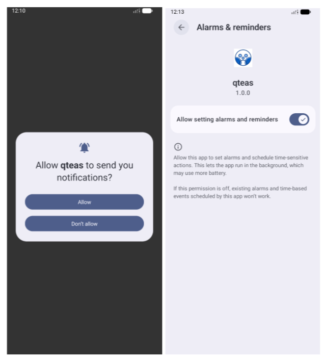 

Figure 1. Initial Setup

When the user first opens the application, they are prompted to enable notifications (Figure 1, First Screenshot). This permission allows the app to send timely alerts such as event reminders, updates, and group chat messages. If granted, the user is directed to the system settings page where notification permissions are confirmed (Figure 1, Second Screenshot).

#### Onboarding Pages:

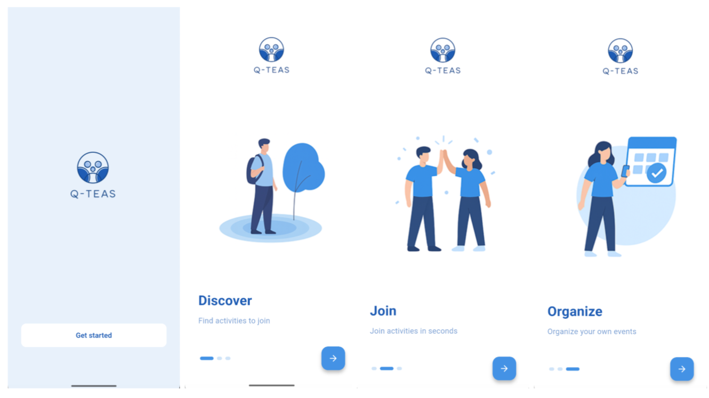 

Figure 2. Onboarding Pages

After completing the initial setup, the user is guided once through a series of onboarding screens that introduce the main features of the app (Figure 2). The onboarding flow highlights three core functions: Discover, Join, and Organize.

#### Registration:

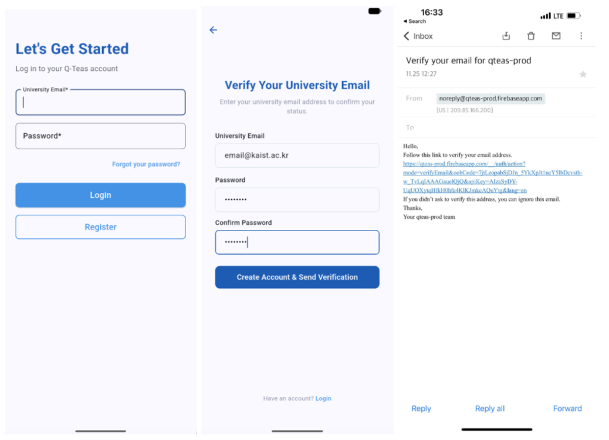 

Figure 3. Registration

To create an account, the user taps Register on the login page (Figure 3, First Screenshot). They are then directed to the registration form, where they enter their university email and password (Figure 3, Second Screenshot). After submitting the form, a verification email is sent to their inbox. The user completes registration by opening the email and confirming their address, after which they are automatically redirected back to the login page (Figure 3, Third Screenshot).

#### First-Time Logging In and Profile Creation:

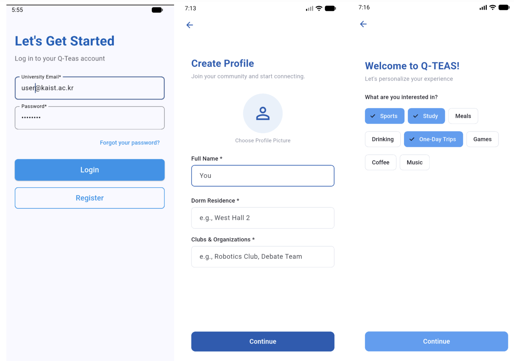 

Figure 4. First-Time Logging In and Profile Creation

After logging in for the first time (Figure 4, First Screenshot), the user is prompted to complete their profile by entering basic information such as their name, dorm, and any clubs or organizations they belong to (Figure 4, Second Screenshot). Once the profile details are submitted, the user is asked to select their interests from a set of suggested categories (Figure 4, Third Screenshot). These preferences are used to personalize event recommendations when they begin using the app.

#### Browsing and Filtering Events:

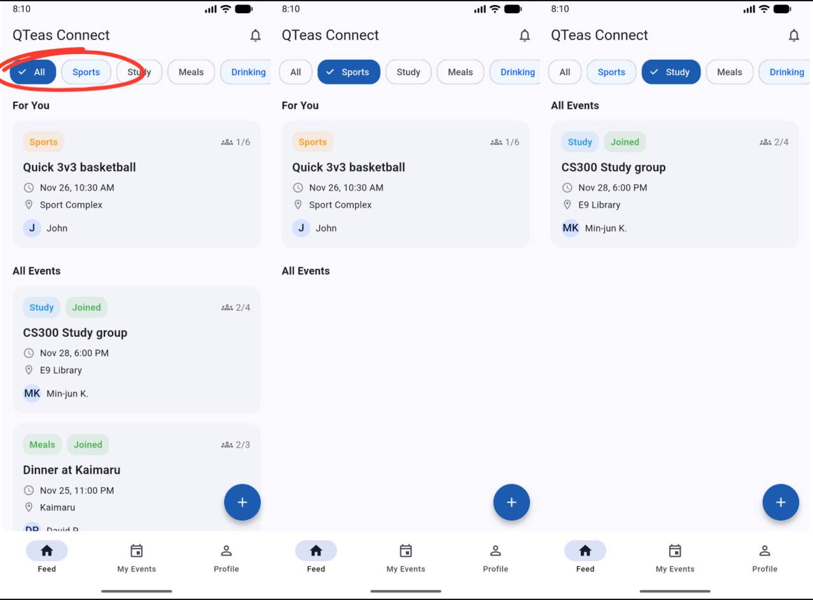 

Figure 5. Browsing and Filtering Events

In the main page "Feed" users see the list of activities that are being organized by all the users. Users are first exposed to the "For You" section in the top half of the page where they can see the recommended activities based on their interests selected at registration. If users look below that, they see the "All Events" section that provides the full list of upcoming activities (Figure 5. First Screenshot).

At the top, users see the category filter bar, displaying options such as Sports, Study, Meals, Drinking, and etc. For the ease of browsing, categories of interest are highlighted with pale blue color. The user can filter events by tapping on one or more categories they are planning to participate in, which will make "Feed" show events only from the same category (Figure 5. Second and Third Screenshots).

#### Joining an Event:

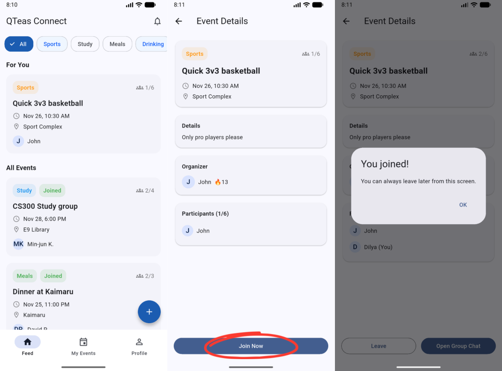 

Figure 6. Joining an Event

When the user taps an event, it directs the user to the "Event Details" page where they see the basic information about the activity (Figure 6. Second Screenshot). If the user decides to participate in that event, they click the "Join Now" button at the bottom of the screen and receive a pop-up that confirms they joined the event (Figure 6. Third Screenshot). Once joined, the event updates to show the user in the participant list (Figure 6. Third Screenshot).

#### Grouping Participants into Chat:

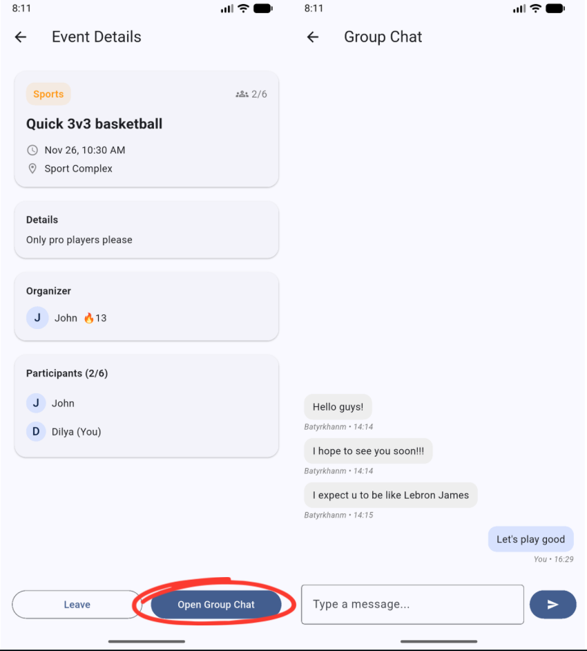 

Figure 7. Grouping into Chat

After joining the event, the user can open the group chat dedicated to that event post through the bottom right blue button (Figure 7. First Screenshot). When the user opens the chat, they can send messages to introduce themselves and discuss event coordination (Figure 7. Second Screenshot).

#### Creating an Event Post:

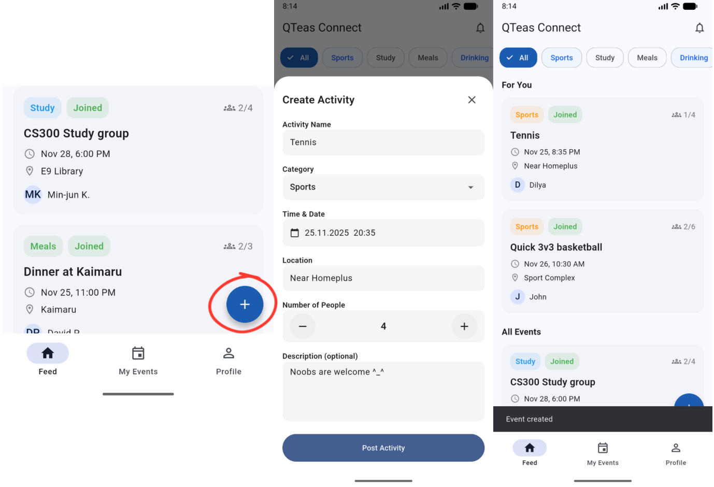 

Figure 8. Creating an Event Post

In the bottom navigation bar of the "Feed" page, the user sees the big blue plus button on the bottom right side of their device (Figure 8. First Screenshot). After tapping the blue circled plus button, the user opens the bottom sheet dialog and fills out the event-related information: Activity Name, Category, Time & Date, Location, and Target Number of Participants (Figure 8. Second Screenshot). To create an event post, the user clicks the "Post Activity" button in the bottom of the screen (Figure 8. Second Screenshot). After creating the post, it appears in the "Feed" page where everyone can see their post (Figure 8. Third Screenshot).

#### A Mandatory Confirmation Check:

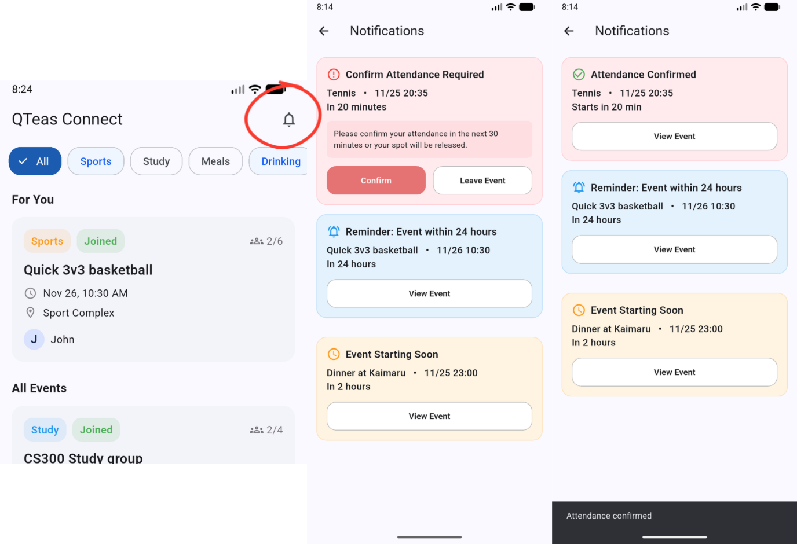 

Figure 9. A Confirmation Check

By tapping the "Bell" button at the top right corner of the "Feed" page (Figure 9. First Screenshot), the user opens the "Notifications" page, where they can see the reminders for the upcoming event of 24 hours (blue colored), 3 hours (yellow colored), and 30 minutes (red colored) before their start time (Figure 9. Second Screenshot). To confirm the user's participation, they need to tap the bold red "Confirm" button, which will make this button disappear and hence make the reminder less intimidating (Figure 9. Third Screenshot).

If the user can't participate in the event, they first need to tap the "Leave Event" button from the "Notifications" page (Figure 9. Second Screenshot). This will direct the user to the "Event Details" page, where they can leave the event by clicking the "Leave" button (Figure 7. First Screenshot).

#### Upcoming Events / Past Events and Rating:

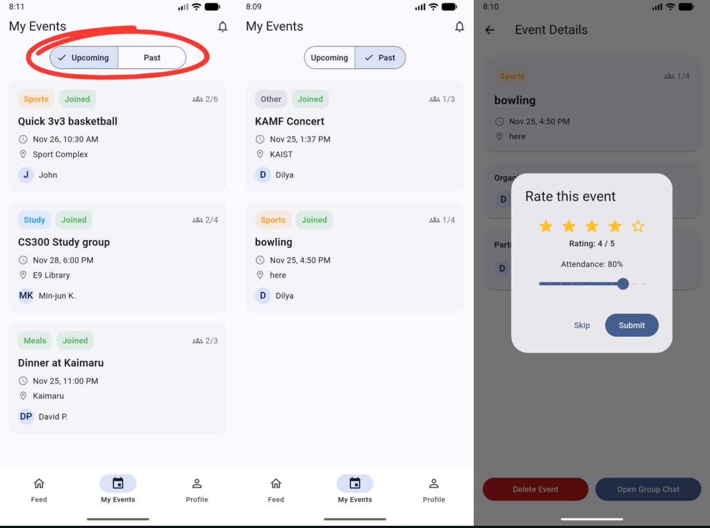 

Figure 10. Upcoming / Past + Rating

If you remember from the previous "Joining an Event" section of this report (Figure 6), the event we have joined also appears in the "My Events" page since the user is automatically considered as a participant for the activity they created (Figure 10. First Screenshot). In the "My Events", users can view activities organized into "Upcoming" and "Past" tabs. After an event has ended, users can open its details only from the "Past" section (Figure 10. Second Screenshot). When the user opens a completed event, they are prompted with a rating dialog to score the experience (from 1 to 5 stars) and estimate attendance percentage, which they can decide to either Skip or Submit (Figure 10. Third Screenshot).

#### Updating personal details in the Edit Profile view:

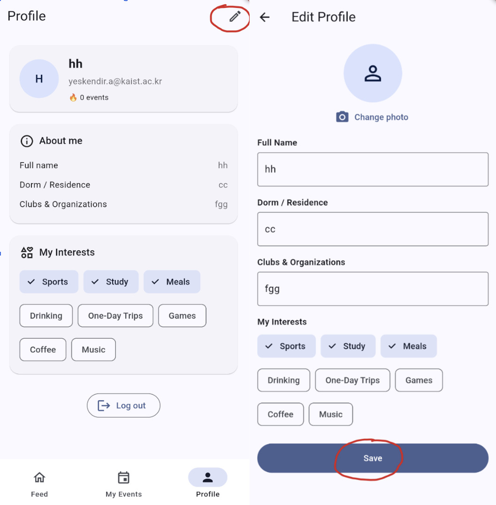 

Figure 11. Profile Update Flow

By tapping the Edit icon on the top-right AppBar of the "Profile" page (Figure 11. First Screenshot), the user opens the "Edit Profile" page, where they can update their basic information, such as their name, dorm/residence, and clubs&organizations. To apply these changes, the user needs to tap the Save button (Figure 11. Second Screenshot). The red circles in the figure indicate the specific locations the user must press to enter edit mode and save their progress.

#### Displaying the user's event participation streak and interest tags:

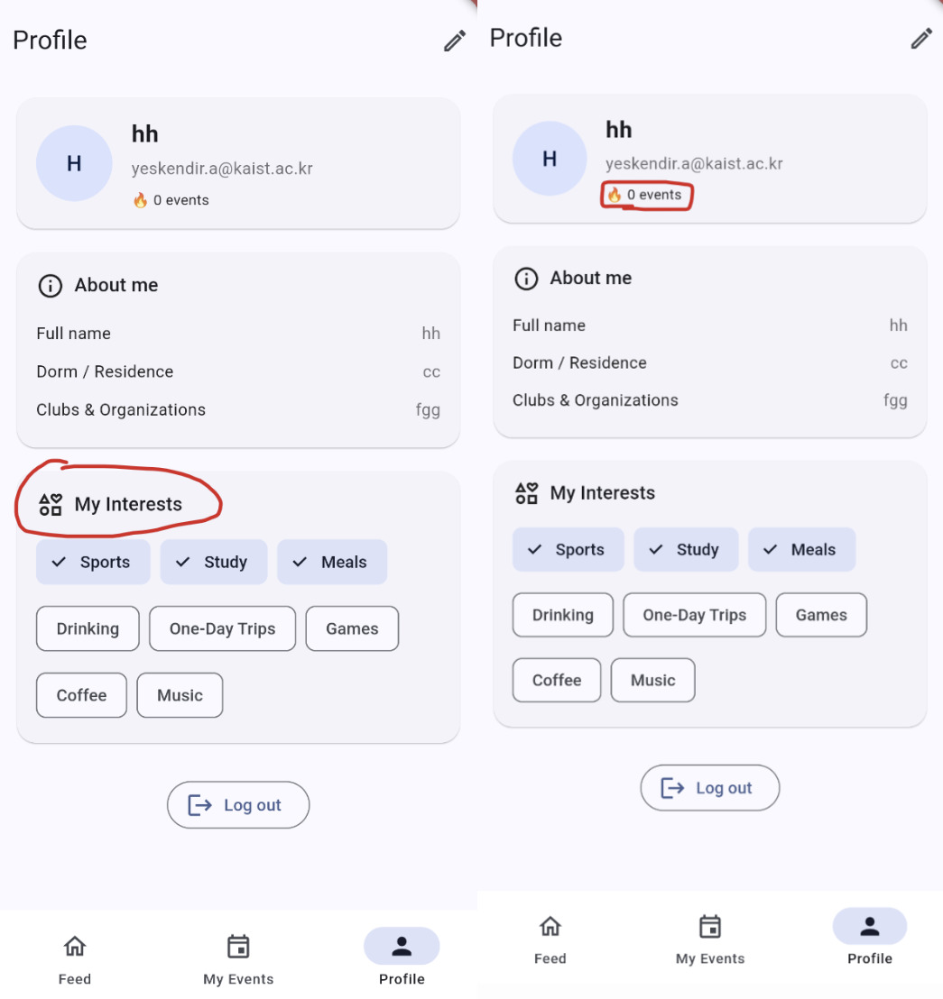 

Figure 12. Viewing User Activity and Interests

To view their specific preferences, the user needs to scroll down to the "My Interests" section, where their interests are displayed as chips (Figure 12. First Screenshot). By observing the top card under their personal details on the "Profile" page, the user can track their participation through the "🔥 X events" indicator, which displays their total engagement count (Figure 12. Second Screenshot). It is important to note that these chips are read-only in this view; to modify them, the user must enter the registration flow or the editing mode described previously. The red indicators in the figure highlight the location of the activity streak and the interests section.

#### Exiting the application by tapping the Log out button at the bottom of the page:

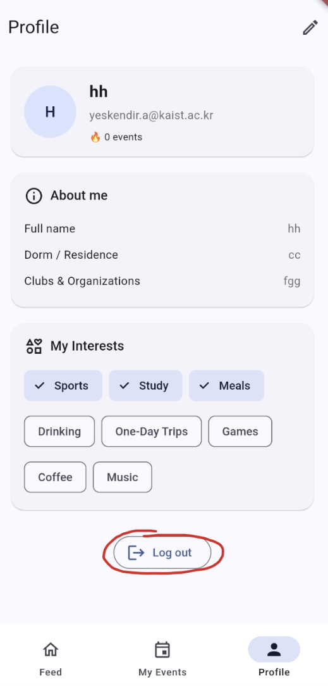 

Figure 13. Logging Out of the Application

To exit the application, the user needs to scroll to the very bottom of the page and tap the "Log out" button (Figure 13). The red circle in the figure indicates the specific location of the button required to sign out of the account.

### **Link to the Prototype:**

[https://drive.google.com/file/d/1Pgle5v1ZokUmYv2TmFthdgt7tY1ycKvm/view?usp=drive_link](https://drive.google.com/file/d/1Pgle5v1ZokUmYv2TmFthdgt7tY1ycKvm/view?usp=drive_link)

### **Link to the Git Repository:**

[https://github.com/bachaquer/Q-Teas](https://github.com/bachaquer/Q-Teas)

### **Libraries and Frameworks:**

#### Frontend

-   Flutter (Material/Cupertino UI)
-   State management: Riverpod
-   Navigation/routing: GoRouter
-   Networking: http
-   Localization & formatting: intl
-   UI extras: badges, image_picker

#### Backend / Services

-   Auth: Firebase Authentication (email/password)
-   Database: Cloud Firestore for events, users, chat messages
-   Firebase integration libs: firebase_core, firebase_auth, cloud_firestore
-   Security: Firestore Security Rules for access control
-   Setup tools: Firebase CLI, FlutterFire CLI for project configuration

#### Client Storage

-   Synced storage: Cloud Firestore as the client-side synchronized data store (events, messages, user profiles)

#### Development

-   flutter_test, flutter_lints

#### Coding Support Tools:

-   ChatGPT
-   Copilot in VSCode

### **Individual Reflections:**

**Dilnaz:**

-   I directly contributed to frontend pages. Particularly, main "feed" page, "event details" page, "create event" bottom sheet, chat pages. Among the features, I have developed feed refreshing, event expiration (removal from feed after start time), chat, showing participants in particular event and their streaks.
-   Difficulties I faced:
    -   Since the free version of Firebase store doesn't consistently check if the events have passed or not, we had a problem of having past events. So, we allowed for regular users' devices to (automatically) send requests to remove the events that have passed from the feed (change status from 'active' to 'complete'). This issue is solved.
    -   The chat history was reversed, we had to fix it. This issue is solved.
    -   The participant streak/scores were not fetched correctly, so needed to update events logic. This issue is solved.
-   I learned how to develop an application on MacOS.

**Batyrkhan:**

-   Built the overall structure of the app, including moving logic between pages and bottom tab bar. For the frontend, worked mainly on design and notifications page, my events page (upcoming and past). Also, worked on event filtering, created mandatory attendance confirmation reminder, review form after the event has finished. Additionally, I put the logo for all dimensions of devices (IOS & Android).
-   Difficulties I faced:
    -   There was an error of having an event with capacity 1 participant and having empty events (organizator wouldn't be able to join again). This issue is solved.
    -   The app fetched only active status events, and therefore we had error of not being able to see anything about the past events. This issue is solved.
    -   The logic of confirming the attendance required some additional logic to show to participants/organizer who confirmed the attendance and who didn't. Apparently, decided to put it inside of event details page, with "(confirmed)" text near their names. This issue is solved.
-   The skill I learned is trusting your teammates some of the crucial tasks

**Yeskendir:**

-   What I contributed:
    -   Set up firebase_core, firebase_auth, cloud_firestore, Android Gradle/Manifest changes, and Firestore security rules tailored to events, participants, and private chats.
    -   Implemented Firebase-backed Auth, Events, and Chat services (login/register, join/leave event with batched writes, event feed reads, chat streams).
    -   Added a membership gate + auto-disposed stream so listeners don't outlive membership changes; eliminated PERMISSION_DENIED after leave-rejoin.
    -   Resolved Android minSdk and permissions; tightened onboarding routing.
-   Difficulties I faced:
    -   Streams continued after a user left an event, causing permission errors. Fixed by membership-driven gating and using autoDispose providers to ensure fresh, rule‑compliant listeners.
    -   User login-registration flow required introducing an additional parameter to track the "Get started" page visibility.
-   Skill I learned:
    -   I learned how to architect a serverless backend using Firebase and seamlessly integrate it with a Flutter frontend

**Guldana:**

-   How I contributed:
    -   I contributed to the design and implementation of the entire onboarding and registration flow on the frontend. This included building the splash screen, multi-page onboarding carousel, university email registration (with academic email validation), verification/password setup screens, profile creation page (name, dorm, clubs, profile picture), and the interests selection interface. I was also responsible for preparing and integrating the images and visual assets used throughout the app. As backend logic was implemented by another team member, I structured the UI and user flows so they could be cleanly connected to authentication and database services.
-   Difficulties I faced:
    -   Setting up Flutter on macOS and dealing with emulator issues, since the Android Studio emulator often failed to run properly, making testing slower.
    -   Adjusting UI layouts to stay fully responsive across different screen sizes, especially when large images caused overflow or misalignment.
    -   Implementing strict academic email validation in a way that was user-friendly while still preventing invalid sign-ups
    -   Finally, because backend integration was handled by another teammate, I had to structure the frontend logic, callbacks, and field validation carefully so the pages remained stable and functional even before the Firebase wiring was fully connected.
-   Skill I learned:
    -   One useful skill I learned was structuring frontend screens and interactions in a way that stays stable and modular, even before backend logic is fully integrated.